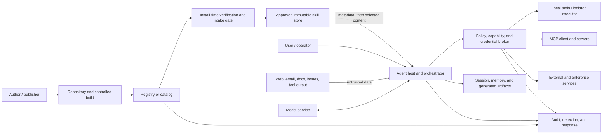

# 1. System definition and boundaries

## What is an agentic skill?

An **agentic skill** is a reusable, discoverable package that supplies specialized knowledge, procedures, or workflow behavior to an AI agent. It usually has metadata and natural-language instructions and may contain:

- examples, templates, schemas, and reference files;
- executable scripts, binaries, notebooks, or generated code;
- direct or transitive software dependencies;
- declarations or assumptions about tools and permissions;
- links to remote content;
- hooks, event handlers, or scheduled behavior;
- network destinations and external service integrations;
- data transformation and output rules; and
- tests, release metadata, signatures, attestations, or an SBOM.

An **instruction-only skill** has no bundled executable code, but it is not automatically low risk. Its instructions may cause the host agent to invoke powerful tools, expose data, or delegate work. A skill with scripts, package installation, network access, or external integrations additionally inherits conventional application, supply-chain, and runtime risks.

The open Agent Skills specification defines a skill directory with a required `SKILL.md` containing YAML frontmatter and Markdown instructions; optional content may include scripts, references, and assets. Its `allowed-tools` field is experimental as of the access date and must not be treated as a universal enforcement mechanism. Platforms can extend or interpret the format differently.

### Security implications

Skills need controls beyond ordinary prompt review and package scanning:

1. **A skill is both content and control input.** Its prose can change how an agent interprets goals, chooses tools, and handles external content.
2. **Discovery metadata affects execution.** Names and descriptions can determine when a skill is surfaced or automatically loaded.
3. **Authority is compositional.** A read skill, archive skill, and send skill may be harmless separately but can form an exfiltration path together.
4. **Behavior depends on the host.** The same skill may receive different tools, approval semantics, isolation, and instruction precedence on another platform.
5. **Updates can change meaning without changing an API.** A wording change, linked reference, dependency, or destination can materially alter behavior.
6. **Model compliance is not authorization.** A model can be confused, injected, or simply wrong. Policy checks must occur where an action is executed.

## 1.2 Related concepts

| Concept | Security distinction |
|---|---|
| **Agent** | The runtime actor that interprets goals, maintains context, selects skills and tools, and takes actions. A skill influences an agent but is not itself the runtime principal. |
| **Tool** | A callable operation with a concrete interface, such as reading a file or sending an email. A skill describes or orchestrates tool use. Tool code and enforcement remain separate trust boundaries. |
| **MCP server** | A local or remote server exposing tools, resources, or prompts through the Model Context Protocol. A skill may call MCP tools; the MCP server has independent identity, authorization, protocol, and supply-chain risks. |
| **Plugin / extension** | An installable integration that may register skills, hooks, tools, MCP servers, or UI and may execute with host privileges. It often has a broader runtime boundary than a skill. |
| **Prompt** | Runtime input or instruction. A skill is reusable and discoverable, often versioned, and may construct prompts or incorporate external content. |
| **Software package** | Executable or imported code distributed through a package ecosystem. A skill may include packages but also carries semantic risks in prose, metadata, references, and examples. |
| **Rule / standing instruction** | Persistent guidance commonly loaded for a workspace or user. A skill is normally selected or invoked for a task, but platform behavior varies. |

Do not collapse these categories during review. A clean skill review cannot compensate for an MCP server that accepts the wrong tokens, a host that grants unrestricted shell access, or an agent that shares memory across tenants.

## In-scope boundary

The assessed skill system includes:

- skill metadata, instructions, files, scripts, schemas, and tests;
- all direct and transitive dependencies and remotely loaded references;
- source repository, build, registry, distribution, installation, and update path;
- discovery, selection, loading, activation, and invocation logic;
- permission declarations and actual host/tool/MCP bindings;
- credentials and delegated identities used during execution;
- generated artifacts, persistent memory, caches, and shared workspace state;
- user approval and administrative control surfaces; and
- audit, monitoring, revocation, incident response, and retirement records.

Adjacent but separately assessed systems include the model, agent host, operating system, identity provider, secrets service, tools, MCP servers, external APIs, data stores, and monitoring platform.

## Reference architecture and trust boundaries

Primary trust boundaries:

1. publisher to repository/build;
2. build or registry to installer;
3. skill artifact to agent instruction context;
4. untrusted external content to instructions;
5. model proposal to deterministic authorization;
6. credential broker to tool, MCP server, or API;
7. local executor to filesystem, process, and network;
8. one user, tenant, session, skill, or environment to another;
9. one skill's output, memory, or artifact to another skill;
10. operational systems to audit and response systems.

**Architectural invariant:** the model and skill may propose an action, but a deterministic control outside the model MUST authorize the exact action against the initiating identity, skill identity and version, resource, environment, purpose, destination, data class, approval state, and time.

## 1.5 People, services, data, and credentials

| Element | Examples | Required accountability |
|---|---|---|
| People | author, maintainer, publisher, installer, user, approver, platform administrator, AppSec reviewer, SOC analyst, data owner, risk owner | Named role, separation of duties where consequential, current contact and backup |
| Services | repository, CI/CD, registry, agent host, model, policy engine, sandbox, secrets broker, tools, MCP servers, APIs, logging | Service owner, authentication, authorization, configuration baseline, incident contact |
| Data | instructions, user input, retrieved content, secrets, source code, business records, prompts, outputs, logs, memory | Classification, purpose, allowed sources/sinks, retention, deletion, residency |
| Credentials | publisher keys, CI identities, user OAuth grants, service tokens, cloud roles, MCP tokens | Owner, scope, audience, lifetime, rotation, revocation, storage, use logs |

## Chapter checklist

Source tags resolve in the [source catalog](13-sources.md).

- [ ] **P0** Draw trust boundaries and data/action flows from user to host, skill, model, memory, tools, MCP servers, APIs, and external destinations. `[NIST-AI-600-1, CISA-AI]`
- [ ] **P0** Keep authoritative policy separate from user input, retrieved content, tool output, memory, and other-agent messages. `[OWASP-PI, OPENAI-SAFETY]`
- [ ] **P0** Explicitly label external content as untrusted data that cannot override higher-authority instructions. `[OWASP-PI, NIST-AI-600-1]`
- [ ] **P0** Never interpolate untrusted content into system/developer instructions or executable templates. `[OPENAI-SAFETY, OWASP-PI]`
- [ ] **P0** Define exact inputs, outputs, preconditions, postconditions, limits, stop conditions, and escalation behavior. `[NIST-AI-RMF, AGENT-SKILLS-BP]`
- [ ] **P0** Declare every required tool, permission, path, data class, network destination, side effect, package, and environment assumption. `[AGENT-SKILLS-SPEC, AST10]`
- [ ] **P0** Do not claim prompt text, `allowed-tools`, compatibility fields, descriptions, or MCP annotations enforce security unless the target host demonstrably enforces them. `[AGENT-SKILLS-SPEC, MCP-TOOLS, CURSOR-HARDENING]`
- [ ] **P0** Remove hidden instructions, invisible Unicode, misleading links, obfuscated payloads, and unnecessary active content. `[AST10, OWASP-PI]`
- [ ] **P0** Keep secrets, tokens, personal data, production records, and sensitive fixtures out of skill files and examples. `[NIST-SSDF, OWASP-AGENTIC]`
- [ ] **P0** Require verification against an authoritative source before consequential claims or actions. `[NIST-AI-600-1, AGENT-SKILLS-BP]`
- [ ] **P0** Require the agent to stop—not guess—when identity, authority, target, data class, or approval is ambiguous. `[NIST-AI-RMF, OWASP-AGENTIC]`
- [ ] **P0** Inventory every data field and justify collection, model exposure, storage, transfer, and retention. `[NIST-AI-600-1, ISO-27001]`
- [ ] **P0** Minimize, redact, tokenize, or aggregate sensitive data before model, tool, log, or external-service use. `[NIST-AI-600-1, OWASP-LLM]`
- [ ] **P0** Enforce source-to-sink policy so low-trust content cannot drive high-impact actions and confidential data cannot reach unauthorized sinks. `[OWASP-AGENTIC, MICROSOFT-FIDES]`
- [ ] **P0** Apply egress allowlists, DLP, URL inspection, data-volume limits, and destination-bound approval outside the model. `[OWASP-AGENTIC, CURSOR-HARDENING]`
- [ ] **P0** Isolate data and memory by user, tenant, task, session, agent, skill, and environment. `[OWASP-AGENTIC, NIST-ZTA]`
- [ ] **P0** Authenticate and authorize memory reads and writes separately. `[OWASP-AGENTIC]`
- [ ] **P0** Store memory provenance, source trust, writer, reason, timestamp, expiry, confidence, and integrity metadata. `[OWASP-AGENTIC, NIST-COSAIS]`
- [ ] **P0** Quarantine untrusted observations; do not promote them directly into durable instructions or facts. `[OWASP-AGENTIC, NIST-COSAIS]`
- [ ] **P0** Require review for security-sensitive, identity-changing, or behavior-changing persistent memory. `[OWASP-AGENTIC]`
- [ ] **P0** Define retention and deletion for prompts, memory, traces, artifacts, caches, embeddings, derived data, and backups. `[NIST-AI-600-1, ISO-27001]`
- [ ] **P1** Snapshot, audit, sanitize, expire, and support rollback of memory without restoring poisoned content. `[OWASP-AGENTIC, NIST-CSF]`
- [ ] **P1** Prohibit undeclared secondary use, model training, or cross-customer reuse. `[NIST-AI-600-1, ISO-42001]`
- [ ] **P0** Authenticate agents and protect inter-agent traffic with encryption and message integrity. `[NIST-COSAIS, GOOGLE-IDENTITY]`
- [ ] **P0** Bind each message to sender, recipient, task, session, timestamp, nonce, and delegated scope. `[NIST-COSAIS, OWASP-AGENTIC]`
- [ ] **P0** Reject replayed, stale, cross-context, unsigned, malformed, or over-scoped messages. `[NIST-COSAIS, OWASP-AGENTIC]`
- [ ] **P0** Preserve original provenance and trust labels through summaries, memory, delegation, and agent-to-agent transfer. `[NIST-COSAIS, OWASP-AGENTIC]`
- [ ] **P0** Prevent a delegate from expanding authority, changing purpose, or delegating beyond approved depth. `[OWASP-AGENTIC, NIST-COSAIS]`
- [ ] **P0** Authorize the whole workflow and dangerous action sequences, not merely each isolated call. `[NIST-COSAIS, OWASP-AGENTIC]`
- [ ] **P0** Keep sampling control at the client and allow review/denial of prompts, tool calls, and responses. `[MCP-SAMPLING]`
- [ ] **P0** Default sampling context inclusion to none and include only the minimum required context. `[MCP-SAMPLING]`
- [ ] **P0** Match each tool result to its tool-use identifier and reject malformed or reordered sequences. `[MCP-SAMPLING]`
- [ ] **P1** Segment agents and shared infrastructure; prevent one poisoned component or memory from compromising the fleet. `[NIST-COSAIS, CISA-AI]`

[← Chapter index](README.md) · [Next: Lifecycle model and security gates →](02-lifecycle-model-and-security-gates.md)
