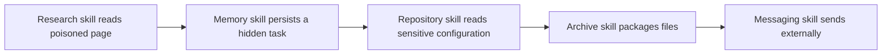

# 3. Threat model

## 3.1 Assets

- publisher and build identities, signing keys, and provenance;
- skill integrity, metadata, reputation, and approved versions;
- user and service identities, tokens, secrets, and delegated authority;
- source code, files, cloud resources, enterprise applications, and production systems;
- personal, confidential, regulated, financial, safety-critical, and proprietary data;
- agent prompts, memory, context, conversation history, and generated artifacts;
- approval state, policy definitions, audit records, and forensic evidence;
- availability, quotas, budgets, and organizational trust.

## 3.2 Threat actors and capabilities

Threat actors include malicious publishers; compromised maintainers, repositories, builds, registries, or update channels; malicious insiders; compromised users or agents; hostile external content providers; malicious MCP/tool operators; and legitimate users misusing approved capabilities.

Assume an attacker may:

- publish, replace, or influence a skill, dependency, reference, or metadata;
- steal maintainer, CI, registry, signing, user, or service credentials;
- inject instructions into documents, websites, email, code comments, issues, memory, or tool responses;
- manipulate skill selection through names, descriptions, collisions, or trigger language;
- return malformed schemas, deceptive success messages, forged approvals, or oversized content;
- exploit excessive access, weak isolation, stale approvals, token confusion, or unsafe parsing;
- chain benign skills and permissions into a prohibited end-to-end flow;
- exploit differences between local, cloud, desktop, CI, or another vendor's host; and
- evade or poison telemetry.

## 3.3 Entry points and abuse paths

| Entry point | Representative abuse path | Potential impact |
|---|---|---|
| Metadata and catalog | misleading description causes automatic selection or hides network/code behavior | wrong skill activation, privilege surprise |
| Instructions/examples | hidden, encoded, conditional, or misleading directives alter agent behavior | data theft, unauthorized action, policy bypass |
| Scripts/dependencies | unsafe command construction, package compromise, install hooks | code execution, persistence, lateral movement |
| Linked/retrieved content | external text is treated as higher-authority instruction | indirect prompt injection, memory poisoning |
| Permissions/credentials | broad token is exposed to model or reused across resources | account takeover, confused deputy |
| Tool/MCP metadata/output | poisoned description or forged response redirects a workflow | exfiltration, false approval, wrong destination |
| Shared state/artifacts | one skill plants instructions consumed by another | delayed and cross-skill compromise |
| Updates | semantic change or dependency swap passes as routine upgrade | fleet-wide compromise, update drift |
| Approval UI | vague, bundled, stale, or replayable approval | unauthorized consequential action |
| Logs/errors | secrets or sensitive content are captured or alerts are suppressed | disclosure, missing visibility |

## 3.4 Composition and authority amplification

Skill risk is not additive. A composition can create authority that no component has alone:

Controls MUST evaluate:

- cumulative read, transform, write, send, administrative, and delegation capabilities;
- information flow from data source and classification to each sink;
- whether delegated authority is narrower than the caller's authority;
- cross-skill sharing of memory, credentials, approvals, files, and artifacts;
- transaction-wide purpose, destination, amount, recipient, and time;
- suspicious sequences, not only isolated tool calls; and
- combinations that must be prohibited even if each permission is approved separately.

Examples of amplification:

- a documentation skill causes a deployment skill to execute commands outside the user's request;
- a summarizer reads a secret that a messaging skill can send;
- a code-generation skill modifies policy consumed by an infrastructure skill;
- a scheduler plus payment skill creates recurring charges; or
- a low-privilege agent delegates to another agent with broader credentials.

## 3.5 Assumptions

- External content, model output, tool output, and skill content are untrusted until validated for their use.
- A valid signature establishes integrity and signer identity under a trust policy; it does not establish safety.
- Prompt hierarchy and sanitization reduce risk but do not reliably prevent all prompt injection.
- Automated scanners have false positives and false negatives and cannot fully infer natural-language intent or emergent composition.
- Users can misunderstand approvals or become fatigued.
- Platforms differ in discovery, invocation, context loading, permission enforcement, isolation, and logging.
- Compromise will occur; containment and recovery are required capabilities.

## 3.6 Skill-specific versus adjacent risks

**Skill-specific:** deceptive discovery metadata; unsafe or malicious instructions; trigger collisions; bundled scripts and references; undeclared capability assumptions; semantic update drift; portable content losing security meaning; skill-to-skill permission laundering.

**Broader agent/model:** hallucination; planning error; prompt-injection susceptibility; context confusion; objective misgeneralization; excessive autonomy; unsafe memory.

**Application/host:** broken authentication or authorization; weak tenant isolation; unsafe credential delivery; inadequate sandboxing; missing quotas, approvals, or logs.

**MCP/tool:** tool-description poisoning; malicious server; token passthrough; incorrect audience; SSRF in discovery; schema confusion; changed server behavior; untrusted output.

Assess and assign owners for all four layers. Do not record a host or MCP weakness as “accepted by the skill owner” unless that owner has authority to remediate or accept the system risk.

## Chapter checklist

Source tags resolve in the [source catalog](13-sources.md).

- [ ] **P0** Threat-model both natural-language instructions and executable code; an instruction-only skill is not automatically low risk. `[AST10, OWASP-AGENTIC]`
- [ ] **P0** Cover malicious publishers, compromised maintainers/builds/registries, insiders, hostile users, poisoned content, compromised tools, and legitimate misuse. `[AST10, MITRE-ATLAS]`
- [ ] **P0** Cover direct, indirect, stored, nested, encoded, multilingual, multimodal, delayed, and cross-agent prompt injection. `[OWASP-PI, OWASP-AGENTIC, NIST-AI-600-1]`
- [ ] **P0** Cover tool poisoning, misleading descriptions, forged annotations/results, name collisions, rug pulls, version drift, and server substitution. `[MCP-TOOLS, AST10, OWASP-AGENTIC]`
- [ ] **P0** Cover excessive agency, confused deputy, privilege escalation, approval bypass/replay, and credential theft. `[OWASP-AGENTIC, MCP-AUTH]`
- [ ] **P0** Cover memory poisoning, stale instructions, cross-user/tenant leakage, and poisoned recovery data. `[OWASP-AGENTIC, NIST-COSAIS]`
- [ ] **P0** Cover harmful capability combinations such as sensitive read + archive + external send. `[OWASP-AGENTIC, NIST-COSAIS]`
- [ ] **P0** Cover unsafe code execution, command injection, path traversal, SSRF, sandbox escape, persistence, and lateral movement. `[OWASP-LLM, MCP-SECURITY]`
- [ ] **P0** Cover data exfiltration through normal APIs, URLs, DNS, logs, covert encodings, generated artifacts, and side channels. `[OWASP-PI, OWASP-AGENTIC]`
- [ ] **P0** Cover runaway loops, retry storms, recursive delegation, fan-out, resource exhaustion, and denial-of-wallet. `[OWASP-AGENTIC, MCP-SAMPLING]`
- [ ] **P0** Cover destructive, financial, legal, safety-critical, reputational, and irreversible outcomes. `[NIST-AI-RMF, NIST-AI-600-1]`

[← Lifecycle model and security gates](02-lifecycle-model-and-security-gates.md) · [Next: Risk tiering and control profiles →](04-risk-tiering-and-control-profiles.md)
